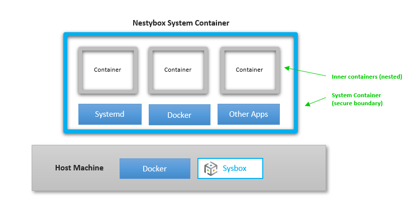

# Sysbox: System Container Runtime

## Contents

-   [Introduction](#introduction)
-   [System Containers](#system-containers)
-   [Download](#download)
-   [Supported Distros](#supported-distros)
-   [Host Requirements](#host-requirements)
-   [Installation](#installation)
-   [Launching a System Container](#launching-a-system-container)
-   [Use Cases](#use-cases)
-   [Features](#features)
-   [Support](#support)
-   [Documentation](#documentation)
-   [Integration with Container Managers](#integration-with-container-managers)
-   [Troubleshooting](#troubleshooting)
-   [Issues](#issues)
-   [Roadmap](#roadmap)
-   [We want your feedback](#we-want-your-feedback)
-   [Uninstallation](#uninstallation)
-   [About Nestybox](#about-nestybox)
-   [Contact](#contact)
-   [Thank You](#thank-you)

## Introduction

Sysbox is a next-generation container runtime, developed by [Nestybox](#about-nestybox),
that enables deployment of containers that are capable of running not just micro-services,
but also system software such as Docker, Kubernetes, Systemd, etc., inside the container.

What makes Sysbox unique is that it can run system software **without requiring
unsecure privileged containers, complicated container images, custom
entrypoints, or complex configurations**.

If you need to run Docker-in-Docker, Kubernetes-in-Docker, or Systemd reliant
apps in Docker, and want to do so securely and avoiding complex images or
configurations, Sysbox is right for you.

Sysbox is super-easy to use: it fully integrates with Docker, thereby allowing you to
deploy these enhanced containers via the familiar Docker CLI. Sysbox works under the covers,
interacting with Docker and the Linux kernel to create the container. No need to learn new
tools.

<p align="center"></p>

The complete list of features is [here](#features).

A list of sample use cases is [here](#use-cases).

And here are a couple of videos showing how it works:

-   [Secure Docker Sandboxing](https://asciinema.org/a/kkTmOxl8DhEZiM2fLZNFlYzbo?speed=1.75)

-   [Secure Kubernetes-in-Docker](<>) (TODO: video link)

## System Containers

We call the containers deployed by Sysbox "system containers", to highlight the
fact that they can run not just micro-services (as regular containers do), but
also system software such as Docker, Kubernetes, Systemd, inner containers, etc.

Traditionally, containers package a single application / micro-service. This
makes sense for application containers, where multiple such containers form the
application and separation of concerns is important.

However, system containers deviate from this a bit: they are meant to be used as
light-weight, super-efficient "virtual hosts", and thus typically bundle
multiple services.

Within the system container you can run the services of your choice (e.g.,
Systemd, sshd, docker, etc.), and even launch (inner) containers just as you
would on a physical host of VM. You can think of it as a **"virtual host"** or a
**"container of containers"**.

Of course, you can package a single service (e.g., Docker daemon) if you so
desire; the choice is yours.

System containers provide an alternative to VMs in many scenarios, but are much more
**flexible, efficient, and portable**. They offer strong isolation (in fact stronger than
regular Docker containers) but to a lesser degree than the isolation provided by a VM.

For more info on system containers, see this [blog article](https://blog.nestybox.com/2019/09/13/system-containers.html).

## Download

The latest release of Sysbox is [here](https://github.com/nestybox/sysbox-external/releases).

Installation instructions are below.

## Supported Distros

Sysbox relies on functionality that is currently only present in Ubuntu Linux.

See the [distro compatibility doc](docs/distro-compat.md) for information on what versions
of Ubuntu kernels are supported.

We plan to add support for more distros in the future.

## Host Requirements

The Linux host on which Sysbox runs must meet the following requirements:

1) It must have one of the supported Linux distros.

2) Systemd must be the system's process-manager (the default in the supported distros).

3) Docker must be installed.

## Installation

1) Download the latest Sysbox package from the [release](https://github.com/nestybox/sysbox-external/releases) page.

2) Verify that the checksum of the downloaded file fully matches the expected/published one.
   For example:

```console
$ sha256sum sysbox_0.1.3-0.ubuntu-disco_amd64.deb
774aa1442c9142a1e6c6db49f896439b989de3668926bccd91aa0a679fa3df87  sysbox_0.1.3-0.ubuntu-disco_amd64.deb
```

3) Install the Sysbox package:

```console
$ sudo dpkg -i sysbox_0.1.3-0.ubuntu-disco_amd64.deb
```

In case you hit an error with missing dependencies, fix this with:

```console
$ sudo apt-get update
$ sudo apt-get install -f -y
```

This will install the missing dependencies and automatically re-launch
the Sysbox installation process.

4) Verify that Sysbox's Systemd units have been properly installed, and
   associated daemons are properly running:

```console
$ systemctl list-units -t service --all | grep sysbox
sysbox-fs.service                   loaded    active   running sysbox-fs component
sysbox-mgr.service                  loaded    active   running sysbox-mgr component
sysbox.service                     loaded    active   exited  Sysbox General Service
```

Note: the sysbox.service is ephemeral (it exits once it launches the other sysbox services; that's why
you see `sysbox.service   loaded  active  exited` above).

If you are curious on what the other Sysbox services are, refer to the [Sysbox design document](docs/design.md).

If you hit problems during installation, see the [Troubleshooting document](docs/troubleshoot.md).

## Launching a System Container

Once Sysbox is installed, you launch a system container with Docker by simply pointing
Docker to the Sysbox container runtime as follows:

```console
$ docker run --runtime=sysbox-runc --rm -it --hostname my_cont debian:latest
root@my_cont:/#
```

If you see an error such as:

    docker: Error response from daemon: OCI runtime create failed: container requires user-ID shifting but error was found: shiftfs module is not loaded in the kernel. Update your kernel to include shiftfs module or enable Docker with userns-remap. Refer to the Sysbox troubleshooting guide for more info: unknown

it means that your kernel version is a bit older than needed by Sysbox. You
can work-around this by enabling the userns-remap mode in Docker. Refer to
the [distro compatibility doc](docs/distro-compat.md) for more info.

Note that if you omit the `--runtime` option, Docker will use its default `runc` runtime
to launch regular application containers (rather than system containers). It's perfectly
fine to run system containers launched with Docker + Sysbox alongside regular Docker
application containers; they won't conflict and can co-exist side-by-side.

The [Sysbox Quickstart Guide](docs/quickstart.md) and the [Nestybox Blog Site](https://blog.nestybox.com) have
many usage examples.

## Use Cases

Below are some sample use-cases, but by no means the only ones.

### Docker sandboxing

-   Deploy a system container with Systemd + ssh + Docker + whatever other services you want.

-   The Docker inside the system container can launch inner containers, and is fully
    isolated from the Docker on the host.

### Deploying a Kubernetes cluster with system containers.

-   Deploy one or more well isolated Kubernetes clusters on a single host,
    without resorting to VMs.

-   Each system container represents a Kubernetes node (master or worker).

-   Kubernetes components and pods run inside the system containers (in total isolation
    from the host).

-   The Kubernetes nodes communicate with each other via a Docker network (e.g., default
    bridge or your own custom bridge network).

### Jenkins sandboxing for CI/CD

-   Deploy Jenkins + Docker inside a system container

-   Jenkins gets a dedicated Docker daemon, fully isolated from the Docker daemon on the host.

-   This avoids [several problems](https://blog.nestybox.com/2019/09/29/jenkins.html).

### Deploying Systemd-reliant apps in containers

-   Some applications require Systemd to function properly.

-   A system container image can bundle Systemd + application + other app dependencies,
    allowing you to easily containerize it.

In general, use cases that up to now required the use of unsecure privileged containers,
complex container configurations, or a resource-hungry Linux VM can benefit from the superior
speed, efficiency, and security provided by the Sysbox container runtime.

The [Sysbox Quickstart Guide](docs/quickstart.md) and the [Nestybox Blog Site](https://blog.nestybox.com) have
more usage examples.

## Features

### Integrates with Docker

-   Launch system containers via the Docker CLI, using Docker images.

### Secure Docker-in-Docker

-   Run Docker inside a container without using unsecure privileged containers.

-   Full isolation between the Docker inside the container and the one in the host.

### Secure Kubernetes-in-Docker

-   Enables deployment of Kubernetes clusters in minutes, with high speed and efficiency.

    -   E.g., deploy a 15 node containerized Kubernetes cluster in less than
        2 minutes, with only 1GB of storage overhead!

-   The Kubernetes cluster can be provisioned directly with Docker or via a
    higher level tools (e.g., K8s.io "kind" or Nestybox's "kindbox").

### Secure Systemd-in-Docker

-   Allows you to containerize apps that rely on Systemd.

### Fast & Efficient

-   Uses host resources optimally to reduce storage overhead when deploying containers.

### Portable

-   Deploy the containers on bare-metal or a VM.

-   Deploy them on premise, in the cloud, an edge device, or even IoT.

### Easily create system container images that come "baked-in" with inner containers

-   Using a simple Dockerfile.

### Easily snapshot running system containers (including inner containers)

-   Using Docker commit.

### Enhanced container isolation

-   Root user in the system container maps to a fully unprivileged user on the host.

-   Each system container gets exclusive range of host user IDs (for increased
    cross-container isolation).

-   Programs inside the system container (e.g., Docker) are limited
    to using the resources given to the system container itself.

-   Processes inside the system container see a partially virtualized `/proc` and `/sys`.

    -   Prevents processes within the container from changing global kernel
        settings.

Please see our [Roadmap](#roadmap) for a list of features we are working on.

## Support

Reach us at our [slack channel][slack] or at `contact@nestybox.com` for any questions.
See our [contact info](#contact) below for more options.

## Documentation

We have several documents to help you get started and get the best out of
system containers.

-   [Sysbox Quick Start Guide](docs/quickstart.md)

    -   Provides many examples for using system containers. New users
        should start here.

-   [Sysbox Distro Compatibility Doc](docs/distro-compat.md)

    -   Distro compatibility requirements.

-   [Sysbox User's Guide](docs/user-guide/README.md)

    -   Provides more detailed information on Sysbox features.

-   [Issue Guidelines](docs/issue-guidelines.md)

    -   Guidelines for filing issues in the Sysbox GitHub project site.

In addition, the [Nestybox blog site](https://blog.nestybox.com) has articles
on how to use system containers.

## Integration with Container Managers

Sysbox is designed to work with Docker.

We don't yet support other container managers (e.g., cri-o, etc).

We don't yet support Kubernetes deploying system containers with Sysbox.

## Troubleshooting

Refer to the [Troubleshooting document](docs/troubleshoot.md).

Please [contact us](#contact) is you need any help.

## Issues

We apologize for any problems in the product or documentation, and we appreciate
customers filing issues that help us improve Sysbox.

To file issues with Sysbox (e.g., bugs, feature requests, documentation changes, etc.),
please refer to the [issue guidelines](docs/issue-guidelines.md) document.

## Roadmap

The following is a list of features in the Sysbox roadmap.

We list these here so that our users can get a better idea of where we
are going and can give us feedback on which of these they like best
(or least).

Nestybox reserves the right to change these based on business
priorities.

Here is the list:

-   Support for more Linux distros.

-   Support for deploying system containers with Kubernetes.

-   Support for other container managers (e.g., cri-o).

-   Exposing host devices within the system container.

-   Running window managers (e.g., X) inside the system container (for GUI apps & desktops).

## We want your feedback

We love feedback, as it helps us improve Sysbox and set its future
direction.

We would much appreciate if you would take a couple of minutes to
answer the following survey:

<https://www.surveymonkey.com/r/SH8HMGY>

## Uninstallation

Prior to uninstalling Sysbox, make sure all system containers are removed.
There is a simple shell script to do this [here](scr/rm_all_syscont).

1) Uninstall Sysbox binaries:

```console
$ sudo dpkg --remove sysbox
```

Alternatively, remove the above items plus all the associated
configuration and Systemd files (recommended):

```console
$ sudo dpkg --purge sysbox
```

2) Remove the `sysbox` user from the system:

```console
$ sudo userdel sysbox
```

## About Nestybox

[Nestybox](https://www.nestybox.com) expands the power of Linux containers.

We are developing software that enables deployment of **system containers**
with Docker (and soon Kubernetes).

Our mission is to make our system containers run as many system-level
workload types as possible in order to provide users a fast,
efficient, and easy-to-use alternative to virtual machines for
deploying virtual hosts on Linux. And for this to work out-of-the-box
and securely, without complex configurations and without resorting to
unsecure privileged containers.

## Contact

We are happy to help. You can reach us at:

Email: `contact@nestybox.com`

Slack: [Nestybox Slack Workspace][slack]

Phone: 1-800-600-6788

We are there from Monday-Friday, 9am-5pm Pacific Time.

## Thank You

We thank you **very much** for using Sysbox. We hope you find it useful.

Your trust in us is very much appreciated.

\-- _The Nestybox Team_

[slack]: https://join.slack.com/t/nestybox-support/shared_invite/enQtOTA0NDQwMTkzMjg2LTAxNGJjYTU2ZmJkYTZjNDMwNmM4Y2YxNzZiZGJlZDM4OTc1NGUzZDFiNTM4NzM1ZTA2NDE3NzQ1ODg1YzhmNDQ
