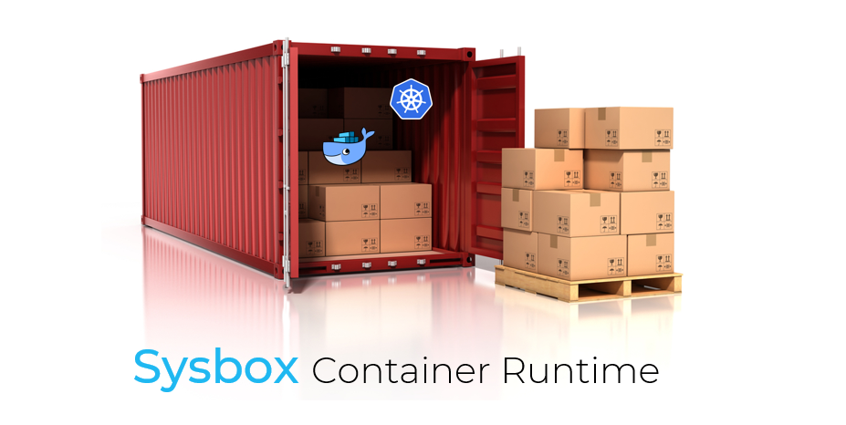

<p align="center"></p>

## Contents

-   [Introduction](#introduction)
-   [System Containers](#system-containers)
-   [Videos](#videos)
-   [Download](#download)
-   [Supported Distros](#supported-distros)
-   [Host Requirements](#host-requirements)
-   [Installation](#installation)
-   [Launching a System Container](#launching-a-system-container)
-   [Shiftfs](#shiftfs)
-   [Sysbox Features](#sysbox-features)
-   [Documentation](#documentation)
-   [Integration with Container Managers](#integration-with-container-managers)
-   [Sysbox is not Rootless Docker](#sysbox-is-not-rootless-docker)
-   [Sysbox enhances K8s.io KinD](#sysbox-enhances-k8sio-kind)
-   [Troubleshooting](#troubleshooting)
-   [Filing Issues](#filing-issues)
-   [Support](#support)
-   [Roadmap](#roadmap)
-   [We want your feedback](#we-want-your-feedback)
-   [Uninstallation](#uninstallation)
-   [About Nestybox](#about-nestybox)
-   [Contact](#contact)
-   [Thank You](#thank-you)

## Introduction

**Sysbox** is a next-generation container runtime, developed by [Nestybox](#about-nestybox),
that enables deployment of containers that are capable of running not just micro-services,
but also system software such as Docker, Kubernetes, Systemd, etc., inside the container,
**easily and securely**.

What makes Sysbox unique is that the containers it creates can **seamlessly** run
system software. It voids the need for unsecure privileged containers,
complicated container images, custom entrypoints, or complex configurations. And
it's very fast and efficient.

Sysbox sits below containers managers such as Docker and Containerd, allowing you to
use these well known tools to deploy the containers. No need to learn new tools!

If you want to run Docker, Kubernetes, or Systemd-reliant apps inside Docker
containers, and want to do so easily, with unmatched efficiency, and securely,
**Sysbox is right for you**.

The complete list of features is [here](#sysbox-features).

## System Containers

We call the containers deployed by Sysbox **system containers**, to highlight the
fact that they can run not just micro-services (as regular containers do), but
also system software such as Docker, Kubernetes, Systemd, inner containers, etc.

More on system containers [here](docs/user-guide/concepts.md#system-container).

## Videos

We have some sample videos showing Sysbox in action:

-   [Docker Sandboxing](https://asciinema.org/a/kkTmOxl8DhEZiM2fLZNFlYzbo?speed=2)

-   [Kubernetes-in-Docker](https://asciinema.org/a/VCgF094wb4CuVeI8h3iDKhh5m?speed=2)

## Download

The latest release of Sysbox is [here](https://github.com/nestybox/sysbox-external/releases).

Installation instructions are below.

## Supported Distros

Sysbox relies on functionality that is currently only present in Ubuntu Linux.

See the [distro compatibility doc](docs/distro-compat.md) for information on what versions
of Ubuntu kernels are supported.

We plan to add support for more distros in the future.

## Host Requirements

The Linux host on which Sysbox runs must meet the following requirements:

1) It must have one of the supported Linux distros.

2) Systemd must be the system's process-manager (the default in the supported distros).

3) Docker must be installed.

## Installation

It's very easy:

1) Download the latest Sysbox package from the [release](https://github.com/nestybox/sysbox-external/releases) page.

2) Verify that the checksum of the downloaded file fully matches the expected/published one.
   For example:

```console
$ sha256sum sysbox_0.1.3-0.ubuntu-disco_amd64.deb
774aa1442c9142a1e6c6db49f896439b989de3668926bccd91aa0a679fa3df87  sysbox_0.1.3-0.ubuntu-disco_amd64.deb
```

3) Install the Sysbox package:

```console
$ sudo dpkg -i sysbox_0.1.3-0.ubuntu-disco_amd64.deb
```

In case you hit an error with missing dependencies, fix this with:

```console
$ sudo apt-get update
$ sudo apt-get install -f -y
```

This will install the missing dependencies and automatically re-launch
the Sysbox installation process.

4) Verify that Sysbox's Systemd units have been properly installed, and
   associated daemons are properly running:

```console
$ systemctl list-units -t service --all | grep sysbox
sysbox-fs.service                   loaded    active   running sysbox-fs component
sysbox-mgr.service                  loaded    active   running sysbox-mgr component
sysbox.service                     loaded    active   exited  Sysbox General Service
```

Note: the sysbox.service is ephemeral (it exits once it launches the other sysbox services; that's why
you see `sysbox.service   loaded  active  exited` above).

If you are curious on what the other Sysbox services are, refer to the [Sysbox User Guide](docs/user-guide/design.md).

If you hit problems during installation, see the [Troubleshooting doc](docs/user-guide/troubleshoot.md).

## Launching a System Container

Once Sysbox is installed, you launch a system container with Docker as follows:

```console
$ docker run --runtime=sysbox-runc --rm -it --hostname my_cont debian:latest
root@my_cont:/#
```

This launches a system container. Looks very much like a regular container,
except that within it you can now run system software such as Docker,
Kubernetes, etc.  without any special configurations or complexity, and securely
(no privileged containers!).

Note that if you omit the `--runtime` option, Docker will use its default `runc`
runtime to launch regular containers (rather than system containers). It's
perfectly fine to run system containers launched with Docker + Sysbox alongside
regular Docker containers; they won't conflict and can co-exist side-by-side.

The [Sysbox Quickstart Guide](docs/quickstart/README.md) and the [Nestybox Blog Site](https://blog.nestybox.com) have
many usage examples.

## Shiftfs

Recent Ubuntu kernels carry a module called "shiftfs" that Sysbox uses to create
the system containers.

When launching the system container, if you see an error such as:

    docker: Error response from daemon: OCI runtime create failed: container requires user-ID shifting but error was found: shiftfs module is not loaded in the kernel. Update your kernel to include shiftfs module or enable Docker with userns-remap. Refer to the Sysbox troubleshooting guide for more info: unknown

it means that your kernel version is a bit older than needed by Sysbox.

You can work-around this by enabling the "userns-remap mode" in Docker. Refer to
the [distro compatibility doc](docs/distro-compat.md) for more info.

## Sysbox Features

### Integrates with Docker

-   Launch system containers via the Docker CLI, using simple Docker images.

### Docker-in-Docker

-   Run Docker inside a container easily and without unsecure privileged containers.

-   Full isolation between the Docker inside the container and the Docker on the host.

### Kubernetes-in-Docker

-   **Easy:** Deploy K8s inside containers, using the K8s.io "kind" tool,
    Nestybox's "kindbox" tool, or even simple `docker run` commands. See [here](#sysbox-enhances-k8sio-kind) for more.

-   **Super efficient:** without Sysbox, a 10-node cluster eats up 10GB; with Sysbox
    its eats up 1GB or less. And it can be deployed in under 2 minutes!

-   **Secure:** avoid using unsecure privileged containers.

-   **Simple:** Use simple Docker images for the K8s nodes; easily embed any inner pod images into them.

### Systemd-in-Docker

-   Run Systemd inside a Docker container easily, without complex container configurations.

-   Enables you to containerize apps that rely on Systemd.

### Fast & Efficient

-   Sysbox uses host resources optimally to reduce container startup time and host
    storage overhead.

### Portable

-   Deploy the containers on bare-metal or a VM.

-   Deploy them on premise, in the cloud, an edge device, or even IoT.

### Easily preload inner container images into the system container image.

-   Using a simple Dockerfile or Docker commit.

### Strong container isolation

-   No unsecure privileged containers!

-   Root user in the system container maps to a fully unprivileged user on the host.

-   Each system container gets exclusive range of host user IDs (for increased
    cross-container isolation).

-   Programs inside the system container (e.g., Docker) are limited
    to using the resources given to the system container itself.

Please see our [Roadmap](#roadmap) for a list of features we are working on.

## Documentation

We have several documents to help you get started and get the best out of
system containers.

-   [Sysbox Quick Start Guide](docs/quickstart/README.md)

    -   Provides many examples for using system containers. New users
        should start here.

-   [Sysbox Distro Compatibility Doc](docs/distro-compat.md)

    -   Distro compatibility requirements.

-   [Sysbox User Guide](docs/user-guide/README.md)

    -   Provides more detailed information on Sysbox features.

-   [Issue Guidelines](docs/issue-guidelines.md)

    -   Guidelines for filing issues in the Sysbox GitHub project site.

In addition, the [Nestybox blog site](https://blog.nestybox.com) has articles
on how to use system containers.

## Integration with Container Managers

Sysbox is designed to work with Docker.

We don't yet support using other container managers (e.g., cri-o, etc). to deploy system containers with Sysbox.

We don't yet support using Kubernetes to deploy system containers with Sysbox.

## Sysbox is not Rootless Docker

Sysbox often gets confused with [Rootless Docker](https://docs.docker.com/engine/security/rootless/), but it's in
fact very different.

Rootless Docker aims to run the Docker daemon in the host without root
privileges, to mitigate security risks. This however results in a number of
[limitations](https://docs.docker.com/engine/security/rootless/#known-limitations)
on what the Docker daemon can do.

Sysbox aims to create containers that can run any system software in them easily
and securely. The Docker on the host, as well as Sysbox, require root privileges
to make this possible. Within the containers however, you can run Docker and Kubernetes,
and they will only have privileges within the containers but none on the host.

What Rootless Docker and Sysbox have in common is that both use the Linux
user-namespace for isolation, but do so in different ways.

## Sysbox enhances K8s.io KinD

The [K8s.io KinD](https://kind.sigs.k8s.io) project produces a CLI tool called
"kind" that enables deployment of Kubernetes clusters inside Docker containers.

It's an excellent tool that makes deployment of K8s cluster in containers fast &
easy.

When used with the Sysbox container runtime, the capabilities of the "kind" tool
are enhanced:

-   The containerized K8s clusters consume ***significantly less host
    storage** (70% reduction for a 10-node cluster!).

-   The cluster is much more **secure** (does not require risky privileged containers).

-   You can use Sysbox to **easily** embed inner pod images into the K8s nodes.

Moreover, with Sysbox, you can easily create a containerized K8s cluster without
using the K8s.io kind tool, by using very simple Docker images and Docker run
commands.

We've created a tool called "kindbox" that is a simple wrapper around Docker
commands to deploy a K8s cluster.

This results in simple images and gives you full control of the
cluster configuration. The Sysbox runtime does the heavy lifting of ensuring
that K8s runs seamlessly inside the containers.

The Sysbox [user-guide](docs/user-guide/kind.md) has more on this.

## Troubleshooting

Refer to the [Troubleshooting document](docs/user-guide/troubleshoot.md)
and to the [issues](https://github.com/nestybox/sysbox-external/issues) in
the GitHub site.

Do [contact us](#contact) if you need any help.

## Filing Issues

We apologize for any problems in the product or documentation, and we appreciate
customers filing issues that help us improve Sysbox.

To file issues with Sysbox (e.g., bugs, feature requests, documentation changes, etc.),
please refer to the [issue guidelines](docs/issue-guidelines.md) document.

## Support

Reach us at our [slack channel][slack] or at `contact@nestybox.com` for any questions.
See our [contact info](#contact) below for more options.

## Roadmap

The following is a list of features in the Sysbox roadmap.

We list these here so that our users can get a better idea of where we
are going and can give us feedback on which of these they like best
(or least).

Nestybox reserves the right to change these based on business
priorities.

Here is the list:

-   Support for more Linux distros.

-   Support for deploying system containers with Kubernetes.

-   Support for other container managers (e.g., cri-o).

-   Exposing host devices within the system container.

-   Running window managers (e.g., X) inside the system container (for GUI apps & desktops).

## We want your feedback

We love feedback, as it helps us improve Sysbox and set its future
direction.

We would much appreciate if you would take a couple of minutes to
answer the following survey:

<https://www.surveymonkey.com/r/SH8HMGY>

## Uninstallation

Prior to uninstalling Sysbox, make sure all system containers are removed.
There is a simple shell script to do this [here](scr/rm_all_syscont).

1) Uninstall Sysbox binaries:

```console
$ sudo dpkg --remove sysbox
```

Alternatively, remove the above items plus all the associated
configuration and Systemd files (recommended):

```console
$ sudo dpkg --purge sysbox
```

2) Remove the `sysbox` user from the system:

```console
$ sudo userdel sysbox
```

## About Nestybox

[Nestybox](https://www.nestybox.com) enhances the power of Linux containers.

We are developing software that enables containers to run **any type of
workload** (not just micro-services), and do so easily and securely.

Our mission is to provide users with a fast, efficient, easy-to-use, and secure
alternative to virtual machines for deploying virtual hosts on Linux.

## Contact

We are happy to help. You can reach us at:

Email: `contact@nestybox.com`

Slack: [Nestybox Slack Workspace][slack]

Phone: 1-800-600-6788

We are there from Monday-Friday, 9am-5pm Pacific Time.

## Thank You

We thank you **very much** for using Sysbox. We hope you find it useful.

Your trust in us is very much appreciated.

\-- _The Nestybox Team_

[slack]: https://join.slack.com/t/nestybox-support/shared_invite/enQtOTA0NDQwMTkzMjg2LTAxNGJjYTU2ZmJkYTZjNDMwNmM4Y2YxNzZiZGJlZDM4OTc1NGUzZDFiNTM4NzM1ZTA2NDE3NzQ1ODg1YzhmNDQ
