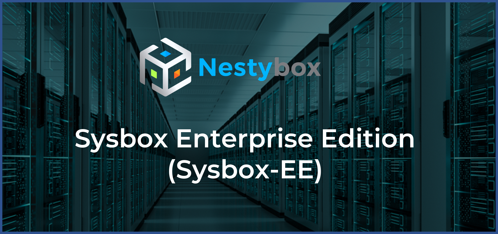

<p align="center"></p>

***

**Sysbox-EE End-of-Life Announcement (07/07/22)**

Prior to the [acquisition by Docker][docker-acquisition] on 05/2022, Nestybox
offered Sysbox Enterprise as an enhanced version of Sysbox (e.g., more security,
more workloads, and official support), via a paid license agreement.

After the acquisition however, Sysbox Enterprise will no longer be offered as a
standalone product. Instead, Docker plans to port some (TBD) Sysbox-EE features
to Sysbox-CE so users can replace the former with the latter.

At this time, **no new licenses of Sysbox-EE are sold and no license renewals
are offered**. This repo will remain open for existing customers as a way to
download Sysbox-EE binaries, but will be phased out in mid 2023 (after all
existing license agreements expire).

***

## Contents

*   [Introduction](#introduction)
*   [Features](#features)
*   [Supported Distros](#supported-distros)
*   [Host Requirements](#host-requirements)
*   [Installation](#installation)
*   [Using Sysbox-EE](#using-sysbox-ee)
*   [Documentation](#documentation)
*   [Filing Issues](#filing-issues)
*   [Support](#support)
*   [About Nestybox](#about-nestybox)
*   [Contact](#contact)
*   [Thank You](#thank-you)

## Introduction

**Sysbox Enterprise Edition** (Sysbox-EE) is the enterprise version of the
open-source [Sysbox container runtime](https://github.com/nestybox/sysbox),
developed by [Nestybox](https://www.nestybox.com).

Sysbox-EE uses Sysbox at its core, but adds enterprise-level features such as:

*   Improved container isolation / security

*   Running more types of system-level workloads inside containers

*   Scalability (running more containers per host)

*   Significant performance and efficiency optimizations (for faster container deployment with reduced disk utilization)

*   Lifecycle (higher release cadence, critical bug fixes ASAP)

*   Nestybox professional support with a guaranteed SLA (rather than best effort on Sysbox)

*   Feature prioritization (Sysbox-EE feature requests are prioritized)

Sysbox-EE is a drop-in replacement for Sysbox. It installs and it's used in the
exact same way, but includes the additional features listed above. On a given
host however, either Sysbox or Sysbox-EE must be installed, never both.

See the [next section](#features) for a comparison between Sysbox-EE and
Sysbox (aka Sysbox Community Edition or Sysbox-CE).

## Features

Features are shown below.

<p align="center">
    
</p>

If you have questions, you can reach us [here](#contact).

## Supported Distros

Sysbox-EE relies on functionality available only in relatively recent Linux kernel
releases.

See the [distro compatibility doc](docs/distro-compat.md) for information about
the supported Linux distributions and the required kernel releases.

We plan to add support for more distros in the near future.

## Host Requirements

The Sysbox-EE host must meet the following requirements:

*   It must be running one of the [supported Linux distros](docs/distro-compat.md).

*   We recommend a minimum of 4 CPUs (e.g., 2 cores with 2 hyperthreads) and 4GB
    of RAM. Though this is not a hard requirement, smaller configurations may
    slow down Sysbox-EE.

## Installation

Sysbox-EE is a drop-in replacement for Sysbox, meaning that it's installed and
used in the same way.

For this reason, the documents in the [Sysbox repo](https://github.com/nestybox/sysbox/tree/master/docs)
apply equally to both Sysbox and Sysbox-EE.

Here are the links to the docs showing how to install Sysbox-EE:

*   [Installation on Docker hosts](https://github.com/nestybox/sysbox/blob/master/docs/user-guide/install-package.md#installing-sysbox-enterprise-edition-sysbox-ee)

*   [Installation on Kubernetes Clusters](https://github.com/nestybox/sysbox/blob/master/docs/user-guide/install-k8s.md#installation-of-sysbox-enterprise-edition-sysbox-ee)

## Using Sysbox-EE

Once Sysbox-EE is installed, you create a container using your container manager
or orchestrator (e.g., Docker or Kubernetes) and an image of your choice.

Docker command example:

```console
$ docker run --runtime=sysbox-runc --rm -it --hostname my_cont registry.nestybox.com/nestybox/ubuntu-bionic-systemd-docker
root@my_cont:/#
```

Kubernetes pod spec example:

```yaml
apiVersion: v1
kind: Pod
metadata:
  name: ubu-bio-systemd-docker
  annotations:
    io.kubernetes.cri-o.userns-mode: "auto:size=65536"
spec:
  runtimeClassName: sysbox-runc
  containers:
  - name: ubu-bio-systemd-docker
    image: registry.nestybox.com/nestybox/ubuntu-bionic-systemd-docker
    command: ["/sbin/init"]
  restartPolicy: Never
```

You can choose whatever container image you want, Sysbox-EE places no requirements
on the image.

Refer to the [Documentation](#documentation) section below for further examples
on how to use Sysbox-EE.

## Documentation

The following documents in the [Sysbox repo](https://github.com/nestybox/sysbox/tree/master/docs)
show how to use Docker and Kubernetes to deploy containers with Sysbox.

These docs apply equally to both Sysbox and Sysbox-EE.

Features that are specific to Sysbox-EE are tagged with **"Sysbox-EE Feature
Highlight"** in the docs.

*   [Sysbox Quick Start Guide](https://github.com/nestybox/sysbox/blob/master/docs/quickstart/README.md)

    *   Provides many examples for using Sysbox to deploy enhanced
        containers. New users should start here.

*   [Sysbox User Guide](https://github.com/nestybox/sysbox/blob/master/docs/user-guide/README.md)

    *   Provides more detailed information on Sysbox features and troubleshooting.

In addition, the [Nestybox blog site](https://blog.nestybox.com) has articles
on how to use Sysbox to deploy containers.

## Filing Issues

We apologize for any problems in the product or documentation, and we appreciate
users filing issues that help us improve Sysbox-EE.

To file issues with Sysbox-EE (e.g., bugs, feature requests, documentation changes, etc.),
please refer to the [issue guidelines](docs/issue-guidelines.md) document.

## Security

If you find bugs or issues that may expose a Sysbox-EE vulnerability, please report
these by sending an email to security@nestybox.com. Please do not open security
issues in this repo. Thanks!

In addition, a few vulnerabilities have recently been found in the Linux kernel
that in some cases reduce or negate the enhanced isolation provided by Sysbox
containers. Fortunately they are all fixed in recent Linux kernels. See the
Sysbox User Guide's [Vulnerabilities & CVEs chapter](https://github.com/nestybox/sysbox/tree/master/docs/user-guide/security-cve.md)
for more info, and reach out on the [Sysbox Slack channel][slack] for further questions.

## Support

Reach us at our [slack channel][slack] or at `contact@nestybox.com` for any questions.
See our [contact info](#contact) below for more options.

Sysbox Enterprise customers get a guaranteed support SLA from Nestybox, and their
issues and requests are prioritized.

## About Nestybox

[Nestybox](https://www.nestybox.com) enhances security and workloads in Linux
containers.

**NOTE: Nestybox was [acquired by Docker][docker-acquisition] on 05/2022.**

## Contact

We are happy to help. You can reach us at:

Email: `contact@nestybox.com`

Slack: [Nestybox Slack Workspace][slack]

Phone: 1-800-600-6788

We are there from Monday-Friday, 9am-5pm Pacific Time.

[slack]: https://join.slack.com/t/nestybox-support/shared_invite/enQtOTA0NDQwMTkzMjg2LTAxNGJjYTU2ZmJkYTZjNDMwNmM4Y2YxNzZiZGJlZDM4OTc1NGUzZDFiNTM4NzM1ZTA2NDE3NzQ1ODg1YzhmNDQ

[sysbox-ee]: https://www.nestybox.com/sysbox-ee

[docker-acquisition]: https://www.docker.com/blog/docker-advances-container-isolation-and-workloads-with-acquisition-of-nestybox/

[docker-desktop]: https://www.docker.com/products/
